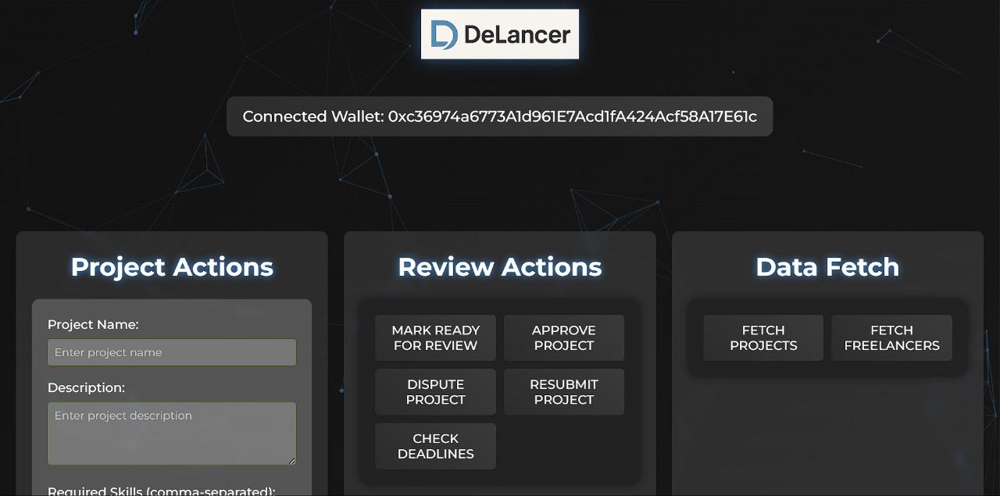
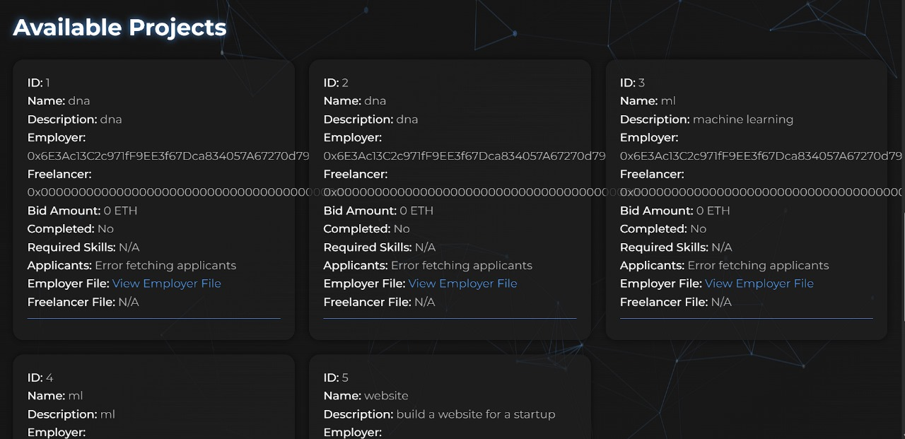
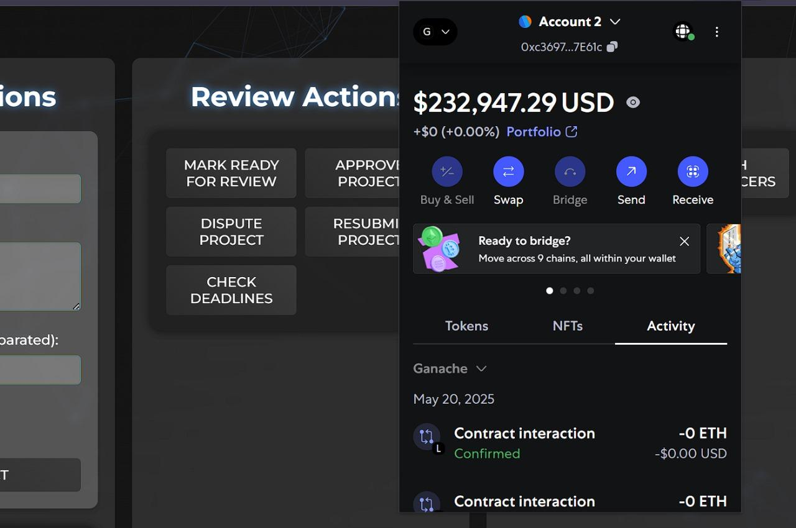
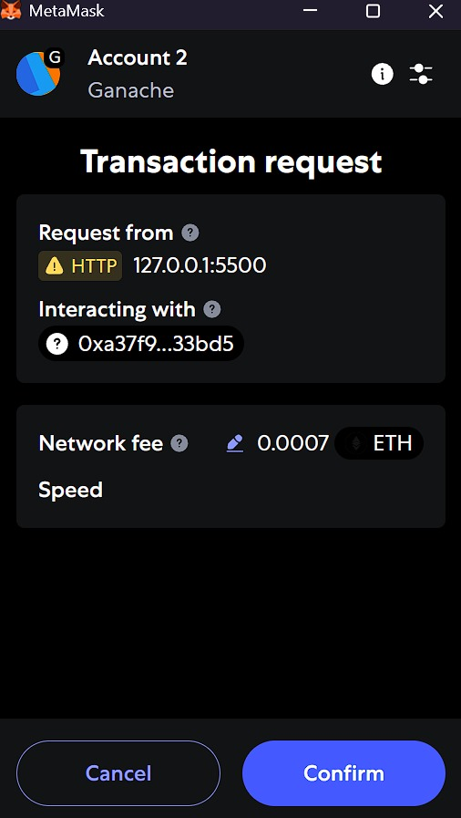
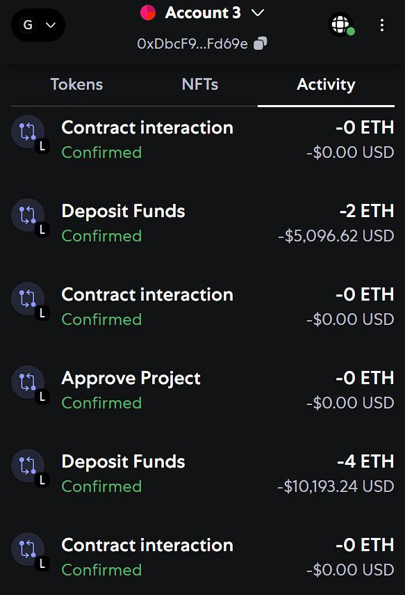
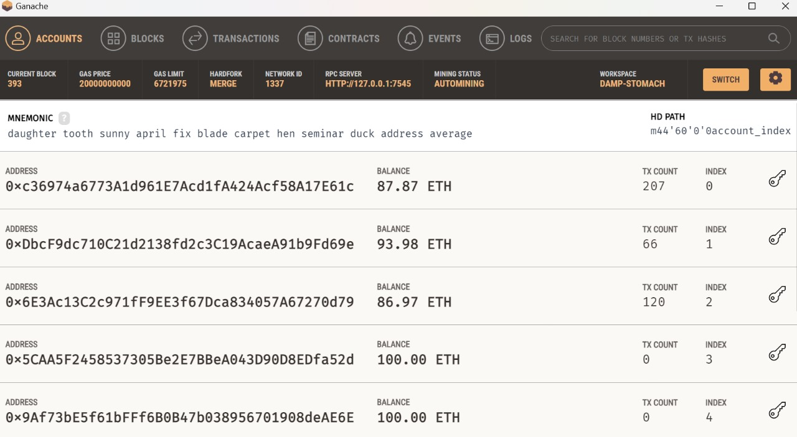

# DeLancer   
### A Decentralized Freelancing Platform on Ethereum

**DeLancer** is a blockchain-based freelancing platform that eliminates intermediaries. It enables clients and freelancers to interact directly through Ethereum smart contracts, ensuring secure payments, transparent bidding, and immutable job records — all without a central authority.

---

##  Features

-  **Decentralized**: All agreements and transactions are secured by smart contracts.
-  **Escrow Payments**: Client payments are locked in the contract and released only upon job approval.
-  **No Middlemen**: Freelancers receive 100% of their earnings.
-  **Immutable Job Records**: Every bid and transaction is permanently recorded on the blockchain.
- **Intelligent Freelancer Selection**: Automatically selects the most suitable freelancer using a weighted scoring system based on bid amount, skill match, experience, reputation, and job completion history.

---

##  Tech Stack

| Layer        | Technology                   |
|--------------|-------------------------------|
| Smart Contracts | Solidity, Truffle             |
| Frontend     | HTML, CSS, JavaScript         |
| Blockchain   | Ethereum (via Ganache/MetaMask) |
| Storage      | Pinata                          |
| Wallet       | MetaMask                      |

---

##  How It Works

### 1. Client Posts a Job
Clients create and post a job by providing project details and a budget. The job is recorded on the Ethereum blockchain.

### 2. Freelancers Place Bids
Freelancers browse available jobs and submit bids, including their proposed price and description.

### 3. Intelligent Assignment
The platform evaluates all bids using a smart algorithm based on:
- Lowest Bid
- Skill Match Score
- Experience Level
- Reputation
- Job Completion History  
The best-matching freelancer is automatically assigned.

### 4. Escrow & Work Delivery
Client’s payment is locked in a smart contract (escrow). Once the freelancer submits the work, the client can approve or reject it.

### 5. Payment Release & Record Update
Upon approval, the escrowed payment is automatically released to the freelancer. The transaction is permanently recorded on-chain.

---

##  Installation & Running Locally

### 1. Clone the Repository

```bash
git clone https://github.com/navjoth/DeLancer.git
cd DeLancer
```

### 2. Install Dependencies

```bash
npm install -g truffle
npm install
```

### 3. Start Local Blockchain

Option 1: Use Ganache UI
Option 2: Run via CLI:

```bash
ganache-cli
```

### 4. Compile & Deploy Smart Contracts

```bash
truffle compile
truffle migrate
```


### 4. Run the Frontend

Simply open public/index.html in your browser.
Interact with the DApp via MetaMask.

Make sure MetaMask is unlocked and connected to the local Ganache network.

##  Demo Images

### Home Page  


### Available projects  


### Metamask Wallet  


### Transaction request  


### Transactions  


### Ganache  


